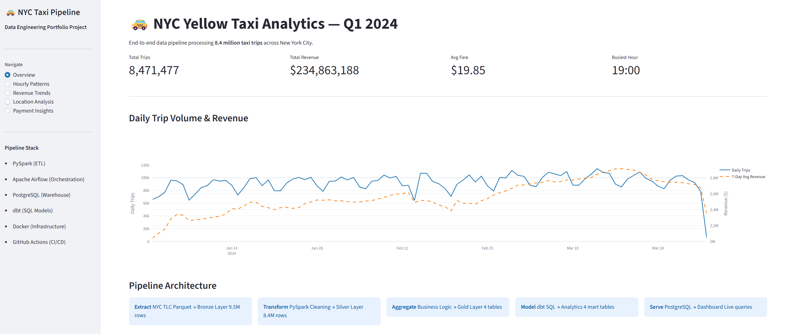
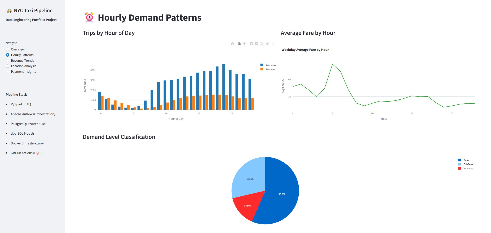
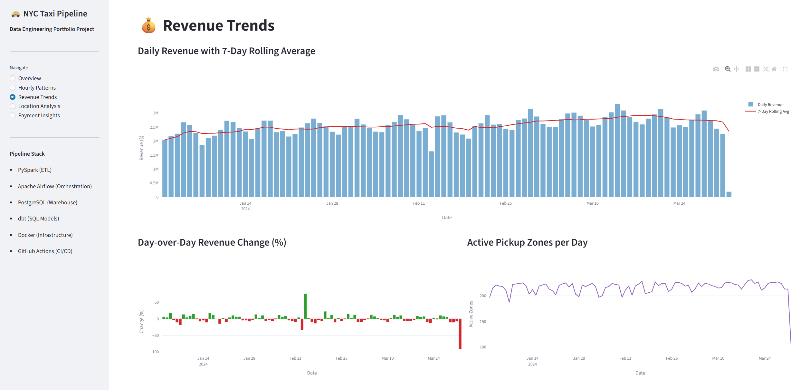
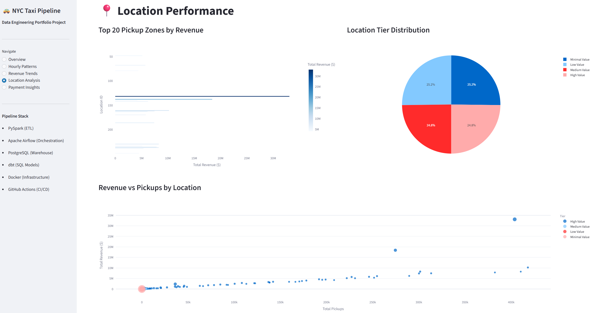
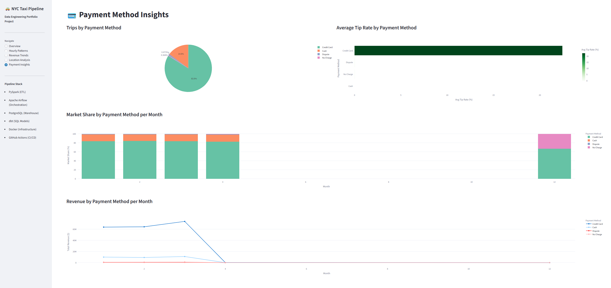

# 🚕 NYC Taxi Analytics Pipeline

> An end-to-end **batch data engineering pipeline** built on the NYC Yellow Taxi dataset — processing **8.4 million real taxi trips** through a full Medallion Architecture (Bronze → Silver → Gold) using industry-standard tools and best practices.

[](https://github.com/emaadkalantarii/nyc-taxi-pipeline/actions/workflows/ci.yml)


---

## 📋 Table of Contents

- [Project Overview](#-project-overview)
- [Architecture](#-architecture)
- [Tech Stack](#-tech-stack)
- [Dataset](#-dataset)
- [Key Results & Insights](#-key-results--insights)
- [Project Structure](#-project-structure)
- [Quick Start](#-quick-start)
  - [Option A: Docker (Recommended)](#option-a-docker-recommended)
  - [Option B: Manual Local Setup](#option-b-manual-local-setup)
- [Pipeline Walkthrough](#-pipeline-walkthrough)
- [Data Quality](#-data-quality)
- [Dashboard](#-dashboard)
- [CI/CD](#-cicd)
- [Skills Demonstrated](#-skills-demonstrated)
- [Future Improvements](#-future-improvements)

---

## 🎯 Project Overview

This project simulates a **real-world production data pipeline** as built and maintained by a data engineering team. Starting from raw NYC taxi trip records, the pipeline ingests, validates, transforms, and serves analytical insights — fully automated, containerized, and tested.

**What makes this project realistic:**
- Real public dataset with genuine data quality issues (negative fares, impossible distances, timestamp errors)
- Production-style Medallion Architecture with three data layers
- Automated orchestration — the pipeline runs on a daily schedule without manual intervention
- Data quality gates that catch and report bad data before it reaches the warehouse
- SQL transformation layer following modern data stack patterns
- CI/CD pipeline that runs tests and linting on every code push

---

## 🏗️ Architecture

```
┌─────────────────────────────────────────────────────────────────────┐
│                         DATA SOURCES                                │
│              NYC TLC Yellow Taxi Parquet Files (Q1 2024)            │
└───────────────────────────┬─────────────────────────────────────────┘
                            │
                            ▼
┌─────────────────────────────────────────────────────────────────────┐
│                      EXTRACT (Bronze Layer)                         │
│   PySpark reads raw Parquet files │ Schema validation               │
│   Ingestion metadata added        │ 9,554,778 rows stored           │
│   Partitioned by VendorID         │ data/bronze/                    │
└───────────────────────────┬─────────────────────────────────────────┘
                            │
                            ▼
┌─────────────────────────────────────────────────────────────────────┐
│                     TRANSFORM (Silver Layer)                        │
│   Data cleaning: invalid fares, distances, passengers removed       │
│   Feature engineering: trip_duration, speed_mph, time_of_day        │
│   is_weekend, fare_per_mile, tip_percentage, payment labels         │
│   8,471,484 rows (11.25% removed as invalid)                        │
│   Partitioned by pickup_month │ data/silver/                        │
└───────────────────────────┬─────────────────────────────────────────┘
                            │
                            ▼
┌─────────────────────────────────────────────────────────────────────┐
│                      AGGREGATE (Gold Layer)                         │
│   hourly_stats (509 rows)   │   location_stats (258 rows)           │
│   payment_stats (18 rows)   │   daily_summary (96 rows)             │
│   data/gold/                                                        │
└───────────────────────────┬─────────────────────────────────────────┘
                            │
                            ▼
┌─────────────────────────────────────────────────────────────────────┐
│                   DATA QUALITY VALIDATION                           │
│   18 automated checks on Silver & Gold layers                       │
│   17/18 checks passing │ HTML report generated                      │
└───────────────────────────┬─────────────────────────────────────────┘
                            │
                            ▼
┌─────────────────────────────────────────────────────────────────────┐
│                    LOAD (PostgreSQL Warehouse)                      │
│   JDBC connection │ 4 Gold tables loaded                            │
│   Indexed for fast analytical queries                               │
└───────────────────────────┬─────────────────────────────────────────┘
                            │
                            ▼
┌─────────────────────────────────────────────────────────────────────┐
│                   dbt SQL TRANSFORMATION LAYER                      │
│   4 staging views │ 4 mart tables                                   │
│   Window functions: LAG, NTILE, PARTITION BY, rolling averages      │
│   analytics schema in PostgreSQL                                    │
└───────────────────────────┬─────────────────────────────────────────┘
                            │
                            ▼
┌─────────────────────────────────────────────────────────────────────┐
│                      ORCHESTRATION & SERVING                        │
│   Airflow DAG: scheduled daily at 06:00 UTC                         │
│   7-task dependency chain with retries & timeouts                   │
│   Streamlit dashboard: 5-page interactive analytics                 │
└─────────────────────────────────────────────────────────────────────┘
```

**Airflow Orchestration DAG — 7 tasks, daily schedule:**

```
start → extract_bronze → transform_silver → transform_gold → validate_data_quality → load_to_postgres → end
```

---

## 🛠️ Tech Stack

| Layer | Tool | Purpose |
|---|---|---|
| **Processing** | PySpark 3.5.0 | Distributed big data transformation |
| **Orchestration** | Apache Airflow 2.9.1 | Pipeline scheduling & monitoring |
| **Warehouse** | PostgreSQL 15 | Analytical data storage |
| **SQL Models** | dbt 1.11 | SQL transformation layer |
| **Data Quality** | Custom validation framework | Automated data quality checks |
| **Containerization** | Docker + Docker Compose | Reproducible infrastructure |
| **CI/CD** | GitHub Actions | Automated testing & linting |
| **Dashboard** | Streamlit + Plotly | Interactive analytics |
| **Languages** | Python, SQL | Core development |
| **File Format** | Apache Parquet | Columnar storage (Bronze/Silver/Gold) |
| **JDBC** | PostgreSQL JDBC Driver | Spark-to-database connectivity |

---

## 📦 Dataset

**Source:** [NYC TLC Yellow Taxi Trip Records](https://www.nyc.gov/site/tlc/about/tlc-trip-record-data.page)

| Property | Value |
|---|---|
| Period | January – March 2024 |
| Raw rows | 9,554,778 |
| Clean rows | 8,471,484 |
| File format | Parquet |
| Key columns | pickup/dropoff timestamps, locations, fare, tip, distance, passengers |

**Real data quality issues found and handled:**
- Negative fare amounts (billing errors)
- Trip distances > 500 miles (GPS glitches)
- Timestamps from 2002, 2008, 2009 (system clock resets)
- Zero passenger trips (system-generated test records)
- Dropoff before pickup (timestamp corruption)

---

## 📊 Key Results & Insights

All insights derived from 8.4 million real NYC taxi trips, Q1 2024:

**Demand Patterns:**
- Peak demand: 17:00–20:00 (evening rush + dinner combined)
- Hour 19 is the single busiest hour with 461,200 trips
- 56.5% of all hours are classified as Peak demand
- Afternoon has the most total trips (2.4M) but night rides carry the highest avg fare ($20.39)

**Revenue:**
- Total Q1 revenue: $234,863,188
- Jan 4 saw an 18% single-day revenue spike
- 7-day rolling average smooths daily volatility for trend analysis
- Active pickup zones fluctuate between ~190–210 per day

**Payment:**
- Credit card dominates at 63.9% of all trips
- Credit card users tip at ~20% rate vs near 0% for cash
- Payment market share is consistent across all three months

**Locations:**
- 258 unique pickup zones analysed
- Top zone generates 30x more revenue than bottom zones
- NTILE quartile analysis segments zones into High/Medium/Low/Minimal value tiers

---

## 📁 Project Structure

```
nyc-taxi-pipeline/
│
├── screenshots/                   # Dashboard screenshots
│   ├── screenshot_overview.png
│   ├── screenshot_hourly.png
│   ├── screenshot_revenue.png
│   ├── screenshot_location.png
│   └── screenshot_payment.png
│
├── dags/                          # Airflow DAGs
│   └── taxi_pipeline_dag.py       # Main orchestration DAG (7 tasks, daily schedule)
│
├── spark_jobs/                    # PySpark ETL scripts
│   ├── spark_utils.py             # Shared SparkSession configuration
│   ├── config.py                  # Central path and settings config
│   ├── explore.py                 # Dataset exploration and profiling
│   ├── extract.py                 # Bronze layer extraction
│   ├── transform_silver.py        # Silver layer: cleaning & feature engineering
│   ├── transform_gold.py          # Gold layer: business aggregations
│   ├── load.py                    # PostgreSQL JDBC loader
│   └── pipeline_tasks.py          # Airflow task wrapper functions
│
├── data_quality/                  # Data validation
│   ├── validate.py                # 18 automated quality checks
│   └── reports/                   # HTML validation reports (gitignored)
│
├── dbt_project/nyc_taxi_dbt/      # dbt SQL transformation layer
│   ├── models/staging/            # 4 staging views (stg_*)
│   └── models/marts/              # 4 analytical mart tables (mart_*)
│
├── dashboard/                     # Streamlit analytics dashboard
│   ├── app.py                     # 5-page interactive application
│   └── requirements.txt           # Dashboard-specific dependencies
│
├── sql/                           # PostgreSQL schema definitions
│   └── create_tables.sql          # DDL: 4 tables + 5 indexes
│
├── tests/                         # Unit tests
│   └── test_transformations.py    # 10 pytest tests for transformation logic
│
├── docker/                        # Docker build files
│   └── Dockerfile.spark           # Custom Spark image with Python packages
│
├── .github/workflows/             # CI/CD automation
│   └── ci.yml                     # GitHub Actions: test + lint on every push
│
├── data/                          # Data lake (gitignored)
│   ├── raw/                       # Source Parquet files (download separately)
│   ├── bronze/                    # Extracted data, partitioned by VendorID
│   ├── silver/                    # Cleaned + enriched, partitioned by month
│   └── gold/                      # Aggregated analytical tables
│
├── docker-compose.yml             # Full infrastructure: PostgreSQL + Airflow + Spark
├── init-db.sql                    # PostgreSQL database and schema initialization
├── requirements.txt               # Python dependencies
├── .env.example                   # Environment variable template (copy to .env)
└── .gitignore
```

---

## 🚀 Quick Start

### Prerequisites

- [Docker Desktop](https://www.docker.com/products/docker-desktop/) installed and running
- [Git](https://git-scm.com/) installed
- [Python 3.11+](https://www.python.org/) (for running Spark scripts locally)
- [Java 11 JDK](https://adoptium.net/temurin/releases/?version=11) (required by PySpark)
- 8GB RAM minimum recommended
- 5GB free disk space for data files

### Clone the repository

```bash
git clone https://github.com/emaadkalantarii/nyc-taxi-pipeline.git
cd nyc-taxi-pipeline
```

### Download the dataset

Download these three Parquet files from the [NYC TLC website](https://www.nyc.gov/site/tlc/about/tlc-trip-record-data.page) and place them in `data/raw/`:

- `yellow_tripdata_2024-01.parquet`
- `yellow_tripdata_2024-02.parquet`
- `yellow_tripdata_2024-03.parquet`

---

### Option A: Docker (Recommended)

This option starts **PostgreSQL, Apache Airflow, and Apache Spark** with a single command. No manual service installation required.

**Step 1 — Configure environment**

```bash
cp .env.example .env
```

**Step 2 — Start all services**

```bash
docker compose up -d
```

Wait ~30 seconds for all services to become healthy:

```bash
docker compose ps
```

| Service | URL | Credentials |
|---|---|---|
| Airflow UI | http://localhost:8080 | admin / admin |
| Spark Master UI | http://localhost:8081 | — |
| PostgreSQL | localhost:5432 | airflow / airflow |

**Step 3 — Create PostgreSQL schema**

```bash
docker compose exec -T postgres psql -U airflow -d nyc_taxi -f /dev/stdin < sql/create_tables.sql
```

**Step 4 — Set up Python environment**

```bash
python -m venv venv
venv\Scripts\activate        # Windows
# source venv/bin/activate   # Mac/Linux

pip install pyspark==3.5.0 pyarrow pandas psycopg2-binary sqlalchemy pg8000
```

> **Windows users:** Download `winutils.exe` and `hadoop.dll` from [cdarlint/winutils](https://github.com/cdarlint/winutils/tree/master/hadoop-3.3.5/bin) and place them in `C:\hadoop\bin\`. Set environment variable `HADOOP_HOME=C:\hadoop`.

**Step 5 — Run the ETL pipeline**

```bash
python spark_jobs/extract.py
python spark_jobs/transform_silver.py
python spark_jobs/transform_gold.py
python data_quality/validate.py
python spark_jobs/load.py
```

**Step 6 — Run dbt SQL models**

```bash
cd dbt_project/nyc_taxi_dbt
dbt run
dbt test
cd ../..
```

**Step 7 — Launch the dashboard**

```bash
streamlit run dashboard/app.py
```

Open http://localhost:8501

**Step 8 — Explore the Airflow DAG**

Open http://localhost:8080 → login `admin/admin` → find `nyc_taxi_pipeline` → click the play button ▶ to trigger a manual run and watch all 7 tasks execute in sequence.

---

### Option B: Manual Local Setup

This option runs everything locally without Docker. Requires PostgreSQL installed on your machine.

**Step 1 — Install PostgreSQL 15** from [postgresql.org](https://www.postgresql.org/download/) and create the databases:

```sql
CREATE USER airflow WITH PASSWORD 'airflow';
CREATE DATABASE airflow OWNER airflow;
CREATE DATABASE nyc_taxi OWNER airflow;
```

```bash
psql -U airflow -d nyc_taxi -f sql/create_tables.sql
```

**Step 2 — Set up Python environment**

```bash
python -m venv venv
venv\Scripts\activate

pip install pyspark==3.5.0 pyarrow pandas psycopg2-binary sqlalchemy pg8000 dbt-core dbt-postgres streamlit plotly pytest
```

**Step 3 — Configure dbt**

Create `~/.dbt/profiles.yml`:

```yaml
nyc_taxi_dbt:
  target: dev
  outputs:
    dev:
      type: postgres
      host: localhost
      port: 5432
      user: airflow
      password: airflow
      dbname: nyc_taxi
      schema: analytics
      threads: 4
```

**Step 4 — Run the full pipeline**

```bash
python spark_jobs/extract.py
python spark_jobs/transform_silver.py
python spark_jobs/transform_gold.py
python data_quality/validate.py
python spark_jobs/load.py

cd dbt_project/nyc_taxi_dbt
dbt run
dbt test
cd ../..

streamlit run dashboard/app.py
```

---

## 🔄 Pipeline Walkthrough

### Phase 1 — Extract (Bronze Layer)

**Script:** `spark_jobs/extract.py`

Reads all three Parquet files with PySpark using an explicit schema (faster than inference). Adds audit columns (`ingestion_timestamp`, `source_file`) and writes partitioned Parquet to `data/bronze/`.

```
Raw Parquet (3 files) → Schema validation → Audit metadata → Bronze Parquet
9,554,778 rows | Partitioned by VendorID
```

### Phase 2 — Transform Silver Layer

**Script:** `spark_jobs/transform_silver.py`

Applies domain-driven cleaning rules then engineers 10 new features:

| Feature | Description |
|---|---|
| `trip_duration_minutes` | Dropoff minus pickup converted to minutes |
| `speed_mph` | Distance ÷ (duration ÷ 60) with zero-guard |
| `pickup_hour` | Hour extracted from pickup timestamp |
| `pickup_day_of_week` | Day number (1=Sunday, 7=Saturday) |
| `pickup_month` | Month number |
| `time_of_day` | morning / afternoon / evening / night bucket |
| `is_weekend` | Boolean: True for Saturday and Sunday |
| `fare_per_mile` | Fare amount ÷ trip distance |
| `tip_percentage` | Tip as percentage of fare |
| `payment_type_desc` | Human-readable payment method label |

```
Bronze (9,554,778) → Clean + Engineer → Silver (8,471,484)
1,075,337 invalid rows removed (11.25%) | Partitioned by pickup_month
```

### Phase 3 — Transform Gold Layer

**Script:** `spark_jobs/transform_gold.py`

Creates 4 business-ready aggregation tables:

| Table | Rows | Description |
|---|---|---|
| `hourly_stats` | 509 | Trips, revenue, speed by hour / day / weekend flag |
| `location_stats` | 258 | Revenue, pickups, tips aggregated by zone |
| `payment_stats` | 18 | Market share by payment method per month |
| `daily_summary` | 96 | Daily KPIs with active pickup zone count |

### Phase 4 — Data Quality Validation

**Script:** `data_quality/validate.py`

Runs 18 automated checks. Generates an HTML report in `data_quality/reports/`.

### Phase 5 — Load to PostgreSQL

**Script:** `spark_jobs/load.py`

Writes all 4 Gold tables to PostgreSQL via JDBC with indexes on commonly filtered columns.

### Phase 6 — dbt SQL Models

**Location:** `dbt_project/nyc_taxi_dbt/models/`

| Model | Type | SQL Concepts |
|---|---|---|
| `stg_hourly_stats` | View | CTE, pass-through staging |
| `stg_daily_summary` | View | CTE, pass-through staging |
| `stg_location_stats` | View | CTE, column renaming |
| `stg_payment_stats` | View | CTE, pass-through staging |
| `mart_peak_hours` | Table | GROUP BY, CASE WHEN, demand classification |
| `mart_revenue_trends` | Table | LAG(), rolling AVG window, day-over-day % |
| `mart_location_performance` | Table | NTILE(4) quartiles, revenue per trip |
| `mart_payment_insights` | Table | PARTITION BY, market share %, NULLIF |

### Phase 7 — Airflow Orchestration

**File:** `dags/taxi_pipeline_dag.py`

- Scheduled daily at 06:00 UTC via cron expression `0 6 * * *`
- 1 automatic retry per task with 5-minute delay
- Execution timeouts preventing hung tasks from blocking the queue
- `catchup=False` prevents historical backfill on first deployment

---

## ✅ Data Quality

**Overall: 17/18 checks passing**

**Silver Layer (13 checks):**

| Check | Result |
|---|---|
| fare_amount > 0 | ✅ 100% |
| trip_distance > 0 | ✅ 100% |
| trip_distance < 500 miles | ✅ 100% |
| passenger_count 1–8 | ✅ 100% |
| total_amount > 0 | ✅ 100% |
| pickup_datetime not null | ✅ 100% |
| dropoff_datetime not null | ✅ 100% |
| trip_duration > 0 | ✅ 100% |
| trip_duration < 180 min | ✅ 100% |
| speed_mph < 150 | ✅ 100% |
| PULocationID not null | ✅ 100% |
| payment_type is valid | ✅ 100% |
| tip_percentage 0–200% | ⚠️ 99.98% — 12 edge-case rows flagged |

**Gold Layer (5 checks):**

| Check | Result |
|---|---|
| No null trip_date | ✅ PASS |
| total_trips always positive | ✅ PASS |
| daily_revenue always positive | ✅ PASS |
| avg_fare is reasonable | ✅ PASS |
| No duplicate dates | ✅ PASS (96 unique dates) |

---

## 📈 Dashboard

The Streamlit dashboard connects directly to PostgreSQL and provides 5 interactive analytical pages.

---

### Overview



The landing page shows four headline KPIs computed from the full dataset: **8,471,477 total trips**, **$234.8M total revenue**, **$19.85 average fare**, and **19:00 as the busiest hour**. The dual-axis line chart plots daily trip volume (blue, left axis) against the 7-day rolling average revenue (orange dashed, right axis) — the rolling average smooths daily noise to reveal the underlying Q1 trend. The Pipeline Architecture cards at the bottom summarise the full data flow from Extract through to Serve.

---

### Hourly Patterns



A grouped bar chart compares weekday (blue) vs weekend (orange) trip volumes across all 24 hours. Weekday mornings peak around 08:00 (commuter rush) and evenings spike at 19:00. Weekend demand builds later and stays elevated into the night. The line chart shows average fare by hour — fares are highest at 04:00–06:00 (early airport runs) then drop as daytime demand rises and trip distances shorten. The demand pie chart classifies all hours into Peak (56.5%), Off-Peak (28.6%), and Moderate (14.9%).

---

### Revenue Trends



Daily revenue bars consistently land between $2M–$3M across Q1 with visible weekly rhythm. The 7-day rolling average (red line) smooths volatility and confirms a gentle upward revenue trend through February into March. The day-over-day percentage change chart (bottom left) shows most daily swings within ±20%, with one notable February spike. The active pickup zones chart (bottom right) shows 190–210 zones active daily — a measure of geographic spread of demand.

---

### Location Analysis



The horizontal bar chart ranks the top 20 pickup zones by total revenue — one zone dominates at over $30M for Q1, roughly 30x the lowest zones. The pie chart confirms the NTILE(4) quartile split is perfectly even at 25% per tier. The scatter plot maps all 258 zones by total pickups (x-axis) vs total revenue (y-axis), with point size encoding average fare — zones in the top-right corner are both high-volume and high-revenue, identifying the most strategically valuable locations in the network.

---

### Payment Insights



Credit card accounts for 63.9% of all trips, with cash at 14.9%. The tip rate bar chart reveals credit card generates ~20% average tip rate while cash is effectively zero — cash passengers rarely record tips in the meter system. The stacked bar chart confirms payment market share is remarkably stable across months 1–4 with no seasonal shift. The revenue line chart shows credit card generates 3–4x more revenue than cash every month, driven by both higher volume and higher tip attachment.

---

## ⚙️ CI/CD

GitHub Actions runs two parallel jobs on every push to `main`:

**`test` job (32s):**
- Python 3.11 clean environment
- Installs pandas and pytest
- Runs 10 unit tests covering all core transformation logic

**`lint` job (6s):**
- Runs flake8 across `spark_jobs/`, `data_quality/`, `tests/`
- Enforces consistent code style on every commit

**Tests cover:** fare filtering, distance bounds, passenger validation, time-of-day classification including boundary hours, trip duration calculation and zero-duration guard, payment type mapping including unknown codes, tip percentage math and division-by-zero guard, weekend detection, speed calculation, null counting logic.

---

## 🧠 Skills Demonstrated

**Data Engineering:**
- Medallion Architecture (Bronze / Silver / Gold)
- ETL pipeline design and implementation
- Big data processing with PySpark (DataFrames, explicit schemas, partitioning, JDBC)
- Columnar storage with Apache Parquet
- Pipeline orchestration with Apache Airflow (DAGs, PythonOperator, scheduling, retries)
- SQL data warehousing with PostgreSQL (schema design, indexing)
- dbt SQL transformation layer (CTEs, materialization strategies, ref() dependency graph)
- Automated data quality validation and HTML reporting

**Software Engineering:**
- Docker and Docker Compose containerization
- CI/CD with GitHub Actions (parallel jobs, test automation)
- Unit testing with pytest (boundary conditions, edge cases)
- Code quality with flake8
- Environment variable management and secrets handling
- Professional Git workflow with descriptive commit history

**SQL Concepts:**
- CTEs (Common Table Expressions)
- Window functions: LAG, LEAD, NTILE, rolling AVG OVER, PARTITION BY
- CASE WHEN classification logic
- NULLIF for division-by-zero safety
- Index design for analytical query optimization
- Multi-schema database design (public + analytics)

---

## 🔮 Future Improvements

- **AWS Integration** — S3 data lake, Glue catalog, Redshift warehouse, EMR for Spark
- **Streaming pipeline** — Apache Kafka + Spark Structured Streaming for real-time ingestion
- **ML layer** — Fare prediction model using engineered trip features
- **Delta Lake** — Replace Parquet with Delta format for ACID transactions and time travel
- **dbt schema tests** — Add not_null, unique, and accepted_values test definitions
- **Monitoring & alerting** — Airflow email alerts on task failure, SLA enforcement
- **Full cloud deployment** — AWS MWAA (Managed Airflow) + RDS PostgreSQL

---

## 👤 Author

**Emad Kalantari**

Master's in Information and Computer Sciences — University of Luxembourg

[](https://www.linkedin.com/in/emad-kalantari)
[](https://github.com/emaadkalantarii)
[](https://emadkalantari.com)

---

## 📄 License

This project is licensed under the MIT License — see the [LICENSE](LICENSE) file for details.

---

*Dataset provided by the NYC Taxi & Limousine Commission (TLC) — publicly available at [nyc.gov](https://www.nyc.gov/site/tlc/about/tlc-trip-record-data.page)*
