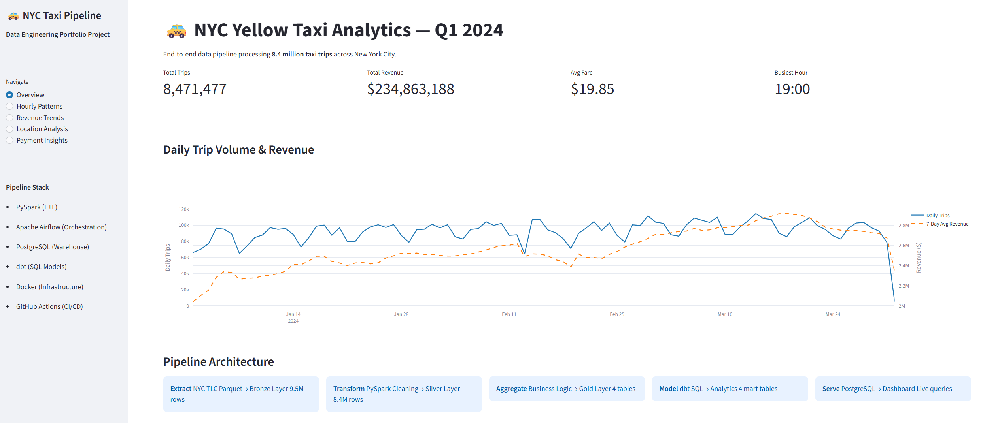
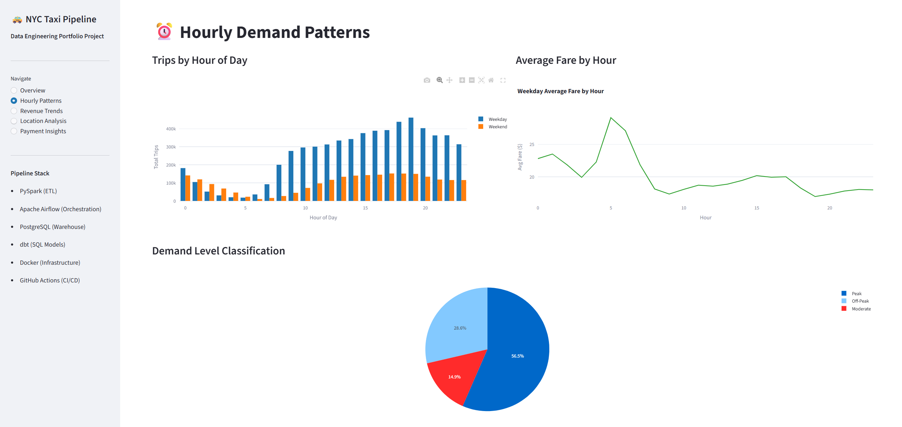
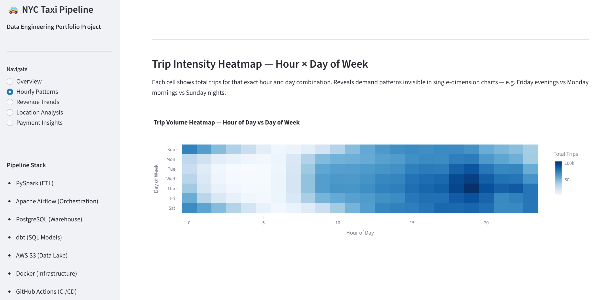
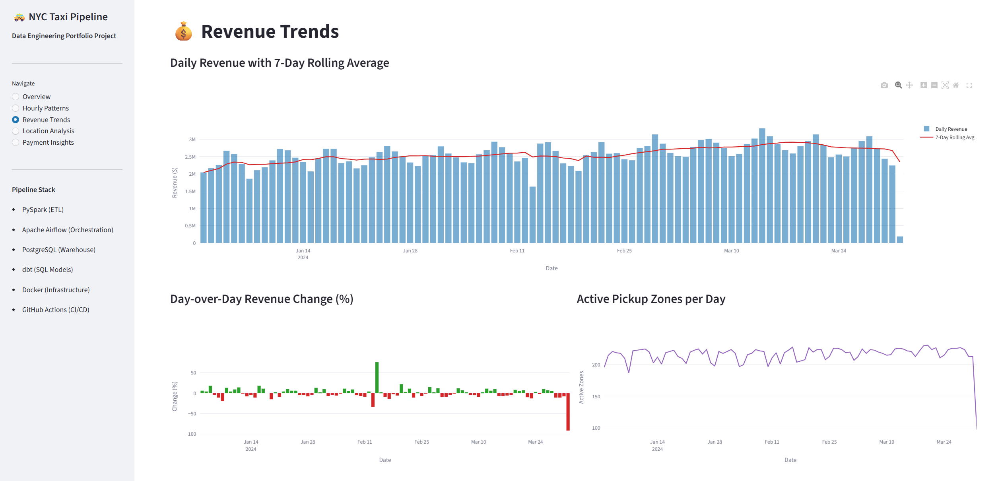
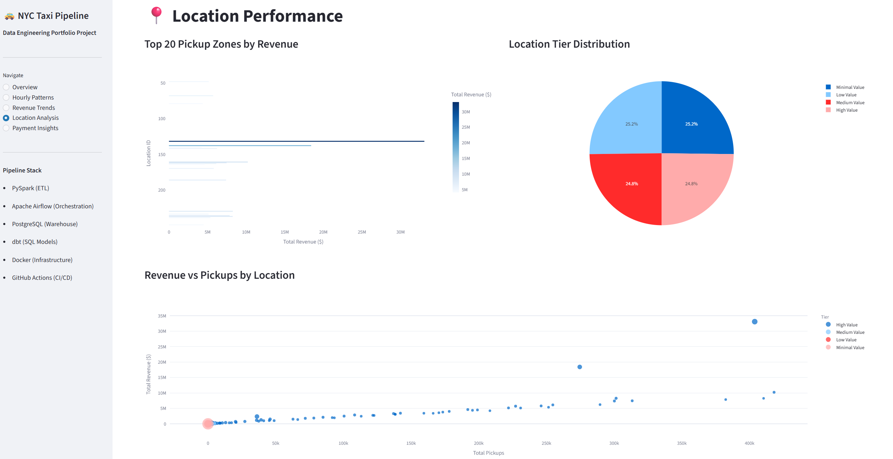
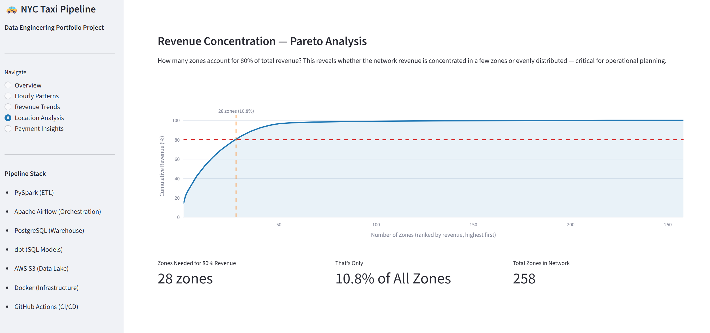
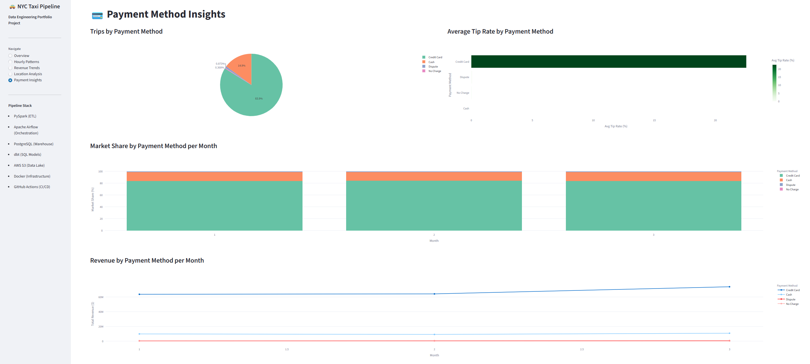
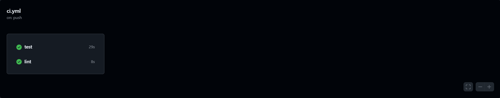
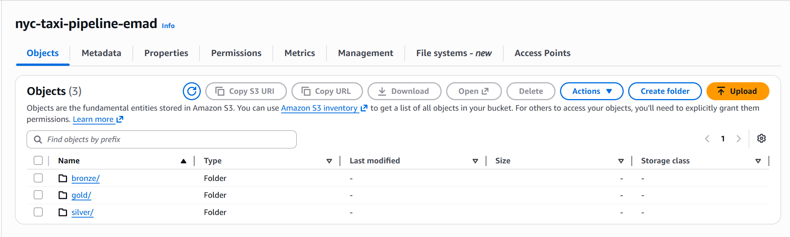

# 🚕 NYC Taxi Analytics Pipeline

> An end-to-end **batch data engineering pipeline** built on the NYC Yellow Taxi dataset — processing **8.4 million real taxi trips** through a full Medallion Architecture (Bronze → Silver → Gold) using industry-standard tools and best practices.

[](https://github.com/emaadkalantarii/nyc-taxi-pipeline/actions/workflows/ci.yml)


---

## 📋 Table of Contents

- [Project Overview](#-project-overview)
- [Key Results](#-key-results)
- [Architecture](#-architecture)
- [Tech Stack](#-tech-stack)
- [Dataset](#-dataset)
- [Project Structure](#-project-structure)
- [Quick Start](#-quick-start)
  - [Option A: Docker (Recommended)](#option-a-docker-recommended)
  - [Option B: Manual Local Setup](#option-b-manual-local-setup)
- [Pipeline Walkthrough](#-pipeline-walkthrough)
- [Pipeline Outputs](#-pipeline-outputs)
- [Data Quality](#-data-quality)
- [Dashboard](#-dashboard)
- [CI/CD](#-cicd)
- [AWS S3 Integration](#-aws-s3-integration)
- [Skills Demonstrated](#-skills-demonstrated)
- [Future Improvements](#-future-improvements)

---

## 🎯 Project Overview

This project simulates a **real-world production data pipeline** as built and maintained by a data engineering team. Starting from raw NYC taxi trip records, the pipeline ingests, validates, transforms, and serves analytical insights — fully automated, containerized, and tested.

**What makes this project realistic:**
- Real public dataset with genuine data quality issues (negative fares, impossible distances, timestamp errors)
- Production-style Medallion Architecture with three data layers
- Automated orchestration — the pipeline runs on a daily schedule without manual intervention
- Data quality gates that catch and report bad data before it reaches the warehouse
- AWS S3 used as a cloud data lake for Bronze, Silver, and Gold layers
- SQL transformation layer following modern data stack patterns
- CI/CD pipeline that runs tests and linting on every code push

---

## 📊 Key Results

| Metric | Value |
|---|---|
| Raw trips ingested | 9,554,778 |
| Clean trips after validation | 8,471,484 (11.25% removed as invalid) |
| Q1 2024 total revenue | $234,863,188 |
| Average fare per trip | $19.85 |
| Busiest hour of day | 19:00 — 461,200 trips |
| Peak demand classification | 56.5% of all hours qualify as Peak |
| Zones driving 80% of revenue | 28 out of 258 zones (10.8% of network) |
| Credit card market share | 63.9% of all trips |
| Credit card avg tip rate | ~20% vs near 0% for cash |
| Data quality checks passing | 17 / 18 (99.98% on flagged check) |
| dbt SQL models built | 8 (4 staging views + 4 mart tables) |
| Dashboard pages | 5 pages, 17 interactive charts |
| Unit tests | 10 pytest tests — all passing in CI |

---

## 🏗️ Architecture

```
┌─────────────────────────────────────────────────────────────────────┐
│                         DATA SOURCES                                │
│              NYC TLC Yellow Taxi Parquet Files (Q1 2024)            │
└───────────────────────────┬─────────────────────────────────────────┘
                            │
                            ▼
┌─────────────────────────────────────────────────────────────────────┐
│                      EXTRACT (Bronze Layer)                         │
│   PySpark reads raw Parquet files │ Schema validation               │
│   Ingestion metadata added        │ 9,554,778 rows stored           │
│   Partitioned by VendorID         │ AWS S3 → s3://bucket/bronze/    │
└───────────────────────────┬─────────────────────────────────────────┘
                            │
                            ▼
┌─────────────────────────────────────────────────────────────────────┐
│                     TRANSFORM (Silver Layer)                        │
│   Data cleaning: invalid fares, distances, passengers removed       │
│   Feature engineering: trip_duration, speed_mph, time_of_day        │
│   is_weekend, fare_per_mile, tip_percentage, payment labels         │
│   8,471,484 rows (11.25% removed as invalid)                        │
│   Partitioned by pickup_month │ AWS S3 → s3://bucket/silver/        │
└───────────────────────────┬─────────────────────────────────────────┘
                            │
                            ▼
┌─────────────────────────────────────────────────────────────────────┐
│                      AGGREGATE (Gold Layer)                         │
│   hourly_stats (509 rows)   │   location_stats (258 rows)          │
│   payment_stats (18 rows)   │   daily_summary (96 rows)            │
│   AWS S3 → s3://bucket/gold/                                        │
└───────────────────────────┬─────────────────────────────────────────┘
                            │
                            ▼
┌─────────────────────────────────────────────────────────────────────┐
│                   DATA QUALITY VALIDATION                           │
│   18 automated checks on Silver & Gold layers                       │
│   17/18 checks passing │ HTML report generated                      │
└───────────────────────────┬─────────────────────────────────────────┘
                            │
                            ▼
┌─────────────────────────────────────────────────────────────────────┐
│                    LOAD (PostgreSQL Warehouse)                       │
│   JDBC connection │ 4 Gold tables loaded                            │
│   Indexed for fast analytical queries                               │
└───────────────────────────┬─────────────────────────────────────────┘
                            │
                            ▼
┌─────────────────────────────────────────────────────────────────────┐
│                   dbt SQL TRANSFORMATION LAYER                      │
│   4 staging views │ 4 mart tables                                   │
│   Window functions: LAG, NTILE, PARTITION BY, rolling averages      │
│   analytics schema in PostgreSQL                                    │
└───────────────────────────┬─────────────────────────────────────────┘
                            │
                            ▼
┌─────────────────────────────────────────────────────────────────────┐
│                      ORCHESTRATION & SERVING                        │
│   Airflow DAG: scheduled daily at 06:00 UTC                         │
│   7-task dependency chain with retries & timeouts                   │
│   Streamlit dashboard: 5-page interactive analytics                 │
└─────────────────────────────────────────────────────────────────────┘
```

**Airflow Orchestration DAG — 7 tasks, daily schedule:**

```
start → extract_bronze → transform_silver → transform_gold → validate_data_quality → load_to_postgres → end
```

---

## 🛠️ Tech Stack

| Layer | Tool | Purpose |
|---|---|---|
| **Processing** | PySpark 3.5.0 | Distributed big data transformation |
| **Orchestration** | Apache Airflow 2.9.1 | Pipeline scheduling & monitoring |
| **Cloud Storage** | AWS S3 + boto3 | Cloud data lake for all Medallion layers |
| **Warehouse** | PostgreSQL 15 | Analytical data storage |
| **SQL Models** | dbt 1.11 | SQL transformation layer |
| **Data Quality** | Custom validation framework | Automated data quality checks |
| **Containerization** | Docker + Docker Compose | Reproducible infrastructure |
| **CI/CD** | GitHub Actions | Automated testing & linting |
| **Dashboard** | Streamlit + Plotly | Interactive analytics (17 charts) |
| **Languages** | Python, SQL | Core development |
| **File Format** | Apache Parquet | Columnar storage (Bronze/Silver/Gold) |
| **JDBC** | PostgreSQL JDBC Driver | Spark-to-database connectivity |

---

## 📦 Dataset

**Source:** [NYC TLC Yellow Taxi Trip Records](https://www.nyc.gov/site/tlc/about/tlc-trip-record-data.page)

| Property | Value |
|---|---|
| Period | January – March 2024 (Q1) |
| Raw rows | 9,554,778 |
| Clean rows | 8,471,484 |
| File format | Apache Parquet |
| Key columns | pickup/dropoff timestamps, locations, fare, tip, distance, passengers |
| License | Public domain — NYC TLC Open Data |

---

## 📁 Project Structure

```
nyc-taxi-pipeline/
│
├── screenshots/                   # All dashboard and infrastructure screenshots
│   ├── screenshot_overview.png
│   ├── screenshot_hourly.png
│   ├── screenshot_revenue.png
│   ├── screenshot_location.png
│   ├── screenshot_payment.png
│   ├── screenshot_heatmap.png
│   ├── screenshot_pareto.png
│   ├── screenshot_cicd.png
│   └── screenshot_s3.png
│
├── dags/                          # Airflow DAGs
│   └── taxi_pipeline_dag.py       # Main orchestration DAG (7 tasks, daily schedule)
│
├── spark_jobs/                    # PySpark ETL scripts
│   ├── spark_utils.py             # Shared SparkSession configuration
│   ├── config.py                  # Central path and settings config
│   ├── load_env.py                # .env file loader for environment variables
│   ├── s3_utils.py                # AWS S3 upload/download helpers (boto3)
│   ├── explore.py                 # Dataset exploration and profiling
│   ├── extract.py                 # Bronze layer extraction + S3 upload
│   ├── transform_silver.py        # Silver layer: cleaning & feature engineering + S3 upload
│   ├── transform_gold.py          # Gold layer: business aggregations + S3 upload
│   ├── load.py                    # PostgreSQL JDBC loader
│   └── pipeline_tasks.py          # Airflow task wrapper functions
│
├── data_quality/                  # Data validation
│   ├── validate.py                # 18 automated quality checks
│   └── reports/                   # HTML validation reports (gitignored)
│
├── dbt_project/nyc_taxi_dbt/      # dbt SQL transformation layer
│   ├── models/staging/            # 4 staging views (stg_*)
│   └── models/marts/              # 4 analytical mart tables (mart_*)
│
├── dashboard/                     # Streamlit analytics dashboard
│   ├── app.py                     # 5-page, 17-chart interactive application
│   └── requirements.txt           # Dashboard-specific dependencies
│
├── sql/                           # PostgreSQL schema definitions
│   └── create_tables.sql          # DDL: 4 tables + 5 indexes
│
├── tests/                         # Unit tests
│   └── test_transformations.py    # 10 pytest tests for transformation logic
│
├── docker/                        # Docker build files
│   └── Dockerfile.spark           # Custom Spark image with Python packages
│
├── .github/workflows/             # CI/CD automation
│   └── ci.yml                     # GitHub Actions: test + lint on every push
│
├── data/                          # Local data lake fallback (gitignored)
│   ├── raw/                       # Source Parquet files (download separately)
│   ├── bronze/                    # Local Bronze fallback
│   ├── silver/                    # Local Silver fallback
│   └── gold/                      # Local Gold fallback
│
├── docker-compose.yml             # Full infrastructure: PostgreSQL + Airflow + Spark
├── init-db.sql                    # PostgreSQL database and schema initialization
├── requirements.txt               # Python dependencies
├── .env.example                   # Environment variable template (copy to .env)
└── .gitignore
```

---

## 🚀 Quick Start

### Prerequisites

- [Docker Desktop](https://www.docker.com/products/docker-desktop/) installed and running
- [Git](https://git-scm.com/) installed
- [Python 3.11+](https://www.python.org/) (for running Spark scripts locally)
- [Java 11 JDK](https://adoptium.net/temurin/releases/?version=11) (required by PySpark)
- AWS account with S3 access (optional — local fallback available without AWS)
- 8GB RAM minimum recommended
- 5GB free disk space for data files

### Clone the repository

```bash
git clone https://github.com/emaadkalantarii/nyc-taxi-pipeline.git
cd nyc-taxi-pipeline
```

### Download the dataset

Download these three Parquet files from the [NYC TLC website](https://www.nyc.gov/site/tlc/about/tlc-trip-record-data.page) and place them in `data/raw/`:

- `yellow_tripdata_2024-01.parquet`
- `yellow_tripdata_2024-02.parquet`
- `yellow_tripdata_2024-03.parquet`

---

### Option A: Docker (Recommended)

This option starts **PostgreSQL, Apache Airflow, and Apache Spark** with a single command. No manual service installation required.

**Step 1 — Configure environment**

```bash
cp .env.example .env
```

Edit `.env` and fill in your AWS credentials if using S3. Set `USE_S3=false` to skip AWS and use local storage instead.

**Step 2 — Start all services**

```bash
docker compose up -d
```

Wait ~30 seconds then verify:

```bash
docker compose ps
```

| Service | URL | Credentials |
|---|---|---|
| Airflow UI | http://localhost:8080 | admin / admin |
| Spark Master UI | http://localhost:8081 | — |
| PostgreSQL | localhost:5432 | airflow / airflow |

**Step 3 — Create PostgreSQL schema**

```bash
docker compose exec -T postgres psql -U airflow -d nyc_taxi -f /dev/stdin < sql/create_tables.sql
```

**Step 4 — Set up Python environment**

```bash
python -m venv venv
venv\Scripts\activate        # Windows
# source venv/bin/activate   # Mac/Linux

pip install pyspark==3.5.0 pyarrow pandas psycopg2-binary sqlalchemy pg8000 boto3
```

> **Windows users:** Download `winutils.exe` and `hadoop.dll` from [cdarlint/winutils](https://github.com/cdarlint/winutils/tree/master/hadoop-3.3.5/bin) and place them in `C:\hadoop\bin\`. Set environment variable `HADOOP_HOME=C:\hadoop`.

**Step 5 — Run the ETL pipeline**

```bash
python spark_jobs/extract.py
python spark_jobs/transform_silver.py
python spark_jobs/transform_gold.py
python data_quality/validate.py
python spark_jobs/load.py
```

**Step 6 — Run dbt SQL models**

```bash
cd dbt_project/nyc_taxi_dbt
dbt run
dbt test
cd ../..
```

**Step 7 — Launch the dashboard**

```bash
streamlit run dashboard/app.py
```

Open http://localhost:8501

**Step 8 — Explore the Airflow DAG**

Open http://localhost:8080 → login `admin/admin` → find `nyc_taxi_pipeline` → click ▶ to trigger a manual run.

---

### Option B: Manual Local Setup

**Step 1 — Install PostgreSQL 15** from [postgresql.org](https://www.postgresql.org/download/) and create the databases:

```sql
CREATE USER airflow WITH PASSWORD 'airflow';
CREATE DATABASE airflow OWNER airflow;
CREATE DATABASE nyc_taxi OWNER airflow;
```

```bash
psql -U airflow -d nyc_taxi -f sql/create_tables.sql
```

**Step 2 — Set up Python environment**

```bash
python -m venv venv
venv\Scripts\activate

pip install pyspark==3.5.0 pyarrow pandas psycopg2-binary sqlalchemy pg8000 boto3 dbt-core dbt-postgres streamlit plotly pytest
```

**Step 3 — Configure dbt**

Create `~/.dbt/profiles.yml`:

```yaml
nyc_taxi_dbt:
  target: dev
  outputs:
    dev:
      type: postgres
      host: localhost
      port: 5432
      user: airflow
      password: airflow
      dbname: nyc_taxi
      schema: analytics
      threads: 4
```

**Step 4 — Run the full pipeline**

```bash
python spark_jobs/extract.py
python spark_jobs/transform_silver.py
python spark_jobs/transform_gold.py
python data_quality/validate.py
python spark_jobs/load.py

cd dbt_project/nyc_taxi_dbt
dbt run && dbt test
cd ../..

streamlit run dashboard/app.py
```

---

## 🔄 Pipeline Walkthrough

### Phase 1 — Extract (Bronze Layer)

**Script:** `spark_jobs/extract.py`

Reads all three Parquet files with PySpark using an explicit schema (faster and safer than schema inference). Adds audit columns (`ingestion_timestamp`, `source_file`) and writes partitioned Parquet to `data/bronze/` locally, then uploads to AWS S3 (`s3://bucket/bronze/`).

```
Raw Parquet (3 files) → Schema validation → Audit metadata → Bronze Parquet
9,554,778 rows | Partitioned by VendorID | Uploaded to AWS S3
```

### Phase 2 — Transform Silver Layer

**Script:** `spark_jobs/transform_silver.py`

Applies domain-driven cleaning rules then engineers 10 new features:

| Feature | Description |
|---|---|
| `trip_duration_minutes` | Dropoff minus pickup converted to minutes |
| `speed_mph` | Distance ÷ (duration ÷ 60) with zero-division guard |
| `pickup_hour` | Hour extracted from pickup timestamp |
| `pickup_day_of_week` | Day number (1=Sunday, 7=Saturday) |
| `pickup_month` | Month number |
| `time_of_day` | morning / afternoon / evening / night bucket |
| `is_weekend` | Boolean: True for Saturday and Sunday |
| `fare_per_mile` | Fare amount ÷ trip distance |
| `tip_percentage` | Tip as percentage of fare |
| `payment_type_desc` | Human-readable payment method label |

```
Bronze (9,554,778) → Clean + Engineer → Silver (8,471,484)
1,075,337 invalid rows removed (11.25%) | Partitioned by pickup_month | Uploaded to AWS S3
```

### Phase 3 — Transform Gold Layer

**Script:** `spark_jobs/transform_gold.py`

Creates 4 business-ready aggregation tables, stored on AWS S3:

| Table | Rows | Description |
|---|---|---|
| `hourly_stats` | 509 | Trips, revenue, speed by hour / day / weekend flag |
| `location_stats` | 258 | Revenue, pickups, tips aggregated by zone |
| `payment_stats` | 18 | Market share by payment method per month |
| `daily_summary` | 96 | Daily KPIs with active pickup zone count |

### Phase 4 — Data Quality Validation

**Script:** `data_quality/validate.py`

Runs 18 automated checks across Silver and Gold layers and generates an HTML report in `data_quality/reports/`.

### Phase 5 — Load to PostgreSQL

**Script:** `spark_jobs/load.py`

Writes all 4 Gold tables to PostgreSQL via JDBC with indexes on commonly filtered columns for fast analytical queries.

### Phase 6 — dbt SQL Models

**Location:** `dbt_project/nyc_taxi_dbt/models/`

| Model | Type | SQL Concepts Used |
|---|---|---|
| `stg_hourly_stats` | View | CTE, pass-through staging |
| `stg_daily_summary` | View | CTE, pass-through staging |
| `stg_location_stats` | View | CTE, column renaming |
| `stg_payment_stats` | View | CTE, pass-through staging |
| `mart_peak_hours` | Table | GROUP BY, CASE WHEN, demand classification |
| `mart_revenue_trends` | Table | LAG(), rolling AVG window, day-over-day % |
| `mart_location_performance` | Table | NTILE(4) quartiles, revenue per trip |
| `mart_payment_insights` | Table | PARTITION BY, market share %, NULLIF |

### Phase 7 — Airflow Orchestration

**File:** `dags/taxi_pipeline_dag.py`

- Scheduled daily at 06:00 UTC via cron `0 6 * * *`
- 1 automatic retry per task with 5-minute delay
- Execution timeouts preventing hung tasks from blocking the queue
- `catchup=False` prevents historical backfill on first deployment

---

## 📤 Pipeline Outputs

| Output | Location | Description |
|---|---|---|
| Bronze Parquet | `data/bronze/` + S3 `bronze/` | Raw data with audit metadata, partitioned by VendorID |
| Silver Parquet | `data/silver/` + S3 `silver/` | Cleaned + engineered, partitioned by pickup_month |
| Gold — hourly_stats | `data/gold/hourly_stats/` + S3 | 509 rows: trips/revenue/speed by hour and day |
| Gold — location_stats | `data/gold/location_stats/` + S3 | 258 rows: revenue and pickups by zone |
| Gold — payment_stats | `data/gold/payment_stats/` + S3 | 18 rows: payment market share per month |
| Gold — daily_summary | `data/gold/daily_summary/` + S3 | 96 rows: daily KPIs with active zone count |
| PostgreSQL — public schema | Tables: hourly_stats, location_stats, payment_stats, daily_summary | Gold layer in relational warehouse |
| PostgreSQL — analytics schema | Views: stg_* (4) │ Tables: mart_* (4) | dbt SQL transformation layer |
| Data quality report | `data_quality/reports/data_quality_report.html` | 18 checks with pass/fail and pass rate |

---

## ✅ Data Quality

**Overall: 17/18 checks passing**

**Real data quality issues found and handled:**

| Issue Found in Raw Data | Action Taken | Rows Affected |
|---|---|---|
| Negative fare amounts | Filtered: fare_amount > 0 required | Billing errors removed |
| Trip distances > 500 miles | Filtered: trip_distance < 500 required | GPS glitch records removed |
| Timestamps from 2002, 2008, 2009 | Filtered via duration > 0 and < 180 min | System clock reset records removed |
| Zero passenger count trips | Filtered: passenger_count ≥ 1 required | System test records removed |
| Dropoff before pickup | Filtered: dropoff > pickup required | Timestamp corruption removed |
| Speed > 150 mph | Filtered: speed_mph < 150 required | Data entry errors removed |
| Trips > 3 hours duration | Filtered: duration < 180 min required | Outlier records removed |
| Total removed | — | 1,075,337 rows (11.25% of raw data) |

**Automated validation results (Silver layer — 50,246 row sample):**

| Check | Result | Pass Rate |
|---|---|---|
| fare_amount > 0 | ✅ PASS | 100.00% |
| trip_distance > 0 | ✅ PASS | 100.00% |
| trip_distance < 500 miles | ✅ PASS | 100.00% |
| passenger_count 1–8 | ✅ PASS | 100.00% |
| total_amount > 0 | ✅ PASS | 100.00% |
| pickup_datetime not null | ✅ PASS | 100.00% |
| dropoff_datetime not null | ✅ PASS | 100.00% |
| trip_duration > 0 | ✅ PASS | 100.00% |
| trip_duration < 180 min | ✅ PASS | 100.00% |
| speed_mph < 150 | ✅ PASS | 100.00% |
| PULocationID not null | ✅ PASS | 100.00% |
| payment_type is valid | ✅ PASS | 100.00% |
| tip_percentage 0–200% | ⚠️ FAIL | 99.98% (12 edge-case rows) |

**Gold layer checks (5/5 passing):**

| Check | Result |
|---|---|
| No null trip_date | ✅ PASS |
| total_trips always positive | ✅ PASS |
| daily_revenue always positive | ✅ PASS |
| avg_fare is reasonable | ✅ PASS |
| No duplicate dates | ✅ PASS (96 unique dates) |

---

## 📈 Dashboard

The Streamlit dashboard connects directly to PostgreSQL and provides **5 interactive pages with 17 charts**.

---

### Overview



The landing page shows four headline KPIs: **8,471,477 total trips**, **$234.8M total revenue**, **$19.85 average fare**, and **19:00 as the busiest hour**. The dual-axis line chart plots daily trip volume (blue, left axis) against the 7-day rolling average revenue (orange dashed, right axis) — the rolling average smooths daily noise to reveal the underlying Q1 trend. The Pipeline Architecture cards summarise the full data flow from Extract through to Serve.

---

### Hourly Patterns



A grouped bar chart compares weekday vs weekend trip volumes across all 24 hours — the morning commute spike (08:00 weekdays) disappears on weekends, replaced by a slower, later build. The line chart shows average fare peaks at 04:00–06:00 (airport runs) then drops as daytime demand rises. The demand pie chart classifies all hours into Peak (56.5%), Off-Peak (28.6%), and Moderate (14.9%).

**Trip Intensity Heatmap — Hour × Day of Week:**



The heatmap reveals demand patterns invisible in single-dimension charts by crossing hour of day with day of week simultaneously. Each cell encodes total trips as color intensity (darker = more trips). Friday and Saturday evenings (17:00–22:00) are the highest-intensity cells. This is how operational teams identify exact staffing needs at the hour×day level.

---

### Revenue Trends



Daily revenue bars consistently between $2M–$3M with the 7-day rolling average overlaid. Most daily swings are within ±20%. The active pickup zones chart shows 190–210 zones active daily — stable geographic coverage throughout Q1.

---

### Location Analysis



Top 20 pickup zones ranked by total revenue — one zone exceeds $30M for Q1. The pie chart confirms the even NTILE(4) quartile split. The scatter plot maps all 258 zones by pickups vs revenue with point size encoding average fare.

**Revenue Concentration — Pareto Analysis:**



Only **28 zones (10.8% of the network)** account for **80% of all Q1 revenue**. The blue filled curve, red 80% threshold line, and orange vertical marker make this finding immediately readable. This is a critical operational insight — 89.2% of zones contribute only 20% of revenue, with direct implications for driver allocation and surge pricing.

---

### Payment Insights



Credit card dominates at 63.9% of trips with ~20% tip rate. Cash is near 0% tip rate — cash passengers rarely record tips in the meter system, revealing a measurement bias in the raw data. The stacked bar chart confirms payment market share is stable across all three months. Credit card generates 3–4x more revenue than cash every month.

---

## ⚙️ CI/CD

GitHub Actions runs two parallel jobs automatically on every push to `main`:



**`test` job (29s):**
- Python 3.11 clean environment
- Installs pandas and pytest
- Runs 10 unit tests covering all core transformation logic

**`lint` job (8s):**
- Runs flake8 across `spark_jobs/`, `data_quality/`, `tests/`
- Enforces consistent code style on every commit

**Tests cover:** fare filtering, distance bounds, passenger validation, time-of-day classification including all boundary hours, trip duration calculation and zero-duration guard, payment type mapping including unknown codes, tip percentage math and division-by-zero guard, weekend detection, speed calculation, null counting logic.

---

## ☁️ AWS S3 Integration

The pipeline uses **AWS S3 as a cloud data lake**, storing all three Medallion layers as partitioned Parquet files. This reflects how real data engineering teams store and share large datasets at scale.



**S3 Bucket Structure:**

```
s3://nyc-taxi-pipeline-emad/
├── raw/                          # Source Parquet files
├── bronze/                       # Extracted data, partitioned by VendorID
│   ├── VendorID=1/
│   └── VendorID=2/
├── silver/                       # Cleaned + enriched, partitioned by month
│   ├── pickup_month=1/
│   ├── pickup_month=2/
│   └── pickup_month=3/
└── gold/                         # Aggregated analytical tables
    ├── hourly_stats/
    ├── location_stats/
    ├── payment_stats/
    └── daily_summary/
```

**Configuration — add to `.env`:**

```env
AWS_ACCESS_KEY_ID=your_access_key_id
AWS_SECRET_ACCESS_KEY=your_secret_access_key
AWS_REGION=eu-west-1
S3_BUCKET=your-bucket-name
USE_S3=true
```

Set `USE_S3=false` to run entirely locally without AWS credentials.

**Key AWS concepts used:**
- **S3 buckets** — object storage for the scalable data lake
- **IAM credentials** — access key + secret key authentication via boto3
- **boto3** — official AWS SDK for Python
- **Hive-style partitioning** — S3 prefix structure mirrors partition columns for efficient filtering
- **Paginated listing** — correctly handles buckets with thousands of objects

---

## 🧠 Skills Demonstrated

**Data Engineering:**
- Medallion Architecture (Bronze / Silver / Gold)
- ETL pipeline design and implementation
- Big data processing with PySpark (DataFrames, explicit schemas, partitioning, JDBC)
- Columnar storage with Apache Parquet
- Pipeline orchestration with Apache Airflow (DAGs, PythonOperator, scheduling, retries)
- SQL data warehousing with PostgreSQL (schema design, indexing)
- dbt SQL transformation layer (CTEs, materialization strategies, ref() dependency graph)
- Automated data quality validation and HTML reporting

**Cloud & Infrastructure:**
- AWS S3 as a scalable cloud data lake with boto3
- IAM-based credential management
- Docker and Docker Compose containerization
- CI/CD with GitHub Actions (parallel jobs, automated testing)

**Software Engineering:**
- Unit testing with pytest (10 tests — boundary conditions, edge cases)
- Code quality enforcement with flake8
- Environment variable management and secrets handling
- Professional Git workflow with descriptive commit history

**SQL Concepts:**
- CTEs (Common Table Expressions)
- Window functions: LAG, NTILE, rolling AVG OVER, PARTITION BY
- CASE WHEN classification and bucketing
- NULLIF for division-by-zero safety
- Index design for analytical query optimization
- Multi-schema database design (public + analytics)

**Analytics & Visualisation:**
- 17-chart interactive Streamlit dashboard
- Pareto analysis revealing revenue concentration (28 zones = 80% of revenue)
- Heatmap for multi-dimensional hour × day demand pattern analysis
- Rolling averages, day-over-day change, quartile ranking

---

## 🔮 Future Improvements

- **AWS Glue** — Automated schema cataloging on top of S3 data lake
- **Amazon Redshift** — Replace PostgreSQL with a cloud-native analytical warehouse
- **AWS EMR** — Run PySpark jobs on a managed Spark cluster instead of locally
- **Streaming pipeline** — Apache Kafka + Spark Structured Streaming for real-time ingestion
- **ML layer** — Fare prediction model using the 10 engineered trip features
- **Delta Lake** — Replace Parquet with Delta format for ACID transactions and time travel
- **dbt schema tests** — Add not_null, unique, and accepted_values test definitions
- **Monitoring & alerting** — Airflow email alerts on task failure, SLA enforcement

---

## 👤 Author

**Emad Kalantari**

Master's in Information and Computer Sciences — University of Luxembourg

[](https://www.linkedin.com/in/emad-kalantari)
[](https://github.com/emaadkalantarii)
[](https://emadkalantari.com)

---

## 📄 License

This project is licensed under the MIT License — see the [LICENSE](LICENSE) file for details.

---

*Dataset provided by the NYC Taxi & Limousine Commission (TLC) — publicly available at [nyc.gov](https://www.nyc.gov/site/tlc/about/tlc-trip-record-data.page)*
